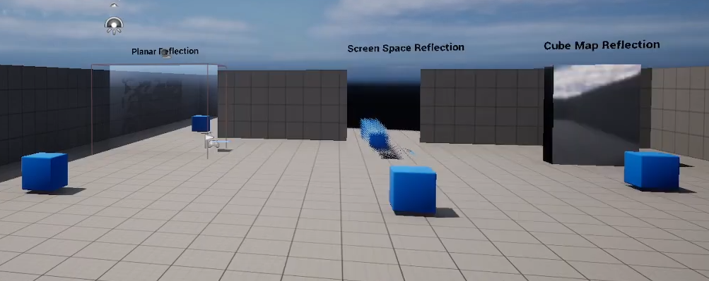

# UE5_ReflectionDemo

Test 영상 링크: https://www.youtube.com/watch?v=-ce-ERjCjwc

# 실행 방법
- `git clone 레포지토리` 명령으로 레포지토리 클론
- `UE5_ReflectionDemo.uproject` 실행(UE 5.0.3으로 작업함)

# Planar Reflection
적용 방법: 
- Planar Reflection Actor배치 
- Planar Reflection 적용할 Actor 배치
- Material설정(Metalic : 1 , roughness : 0)

# Screen Space Reflection
적용 방법: 
- Screen Space Reflection 적용할 Actor 배치
- Material설정(Metalic : 1 , roughness : 0, blend mode: truanslucent, screen space reflection : true, lighting mode: surface translucencyVolume)

# Cubemap Reflection
적용 방법: 
- Cubemap Reflection적용할 Actor 배치
- Material설정(Metalic : 1, roughness : 0)
- Box Reflection Capture or Sphere Reflection Capture Actor 배치
- Build Reflection Capture로 Cube Map Build

# 각 방식의 장단점
블로그 정리 : https://velog.io/@15ywt/%EA%B7%B8%EB%9E%98%ED%94%BD%EC%8A%A4-Reflection
